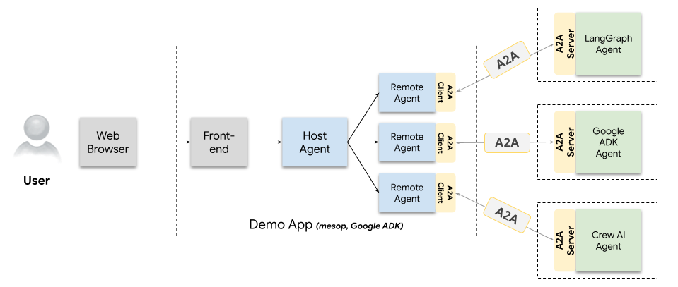
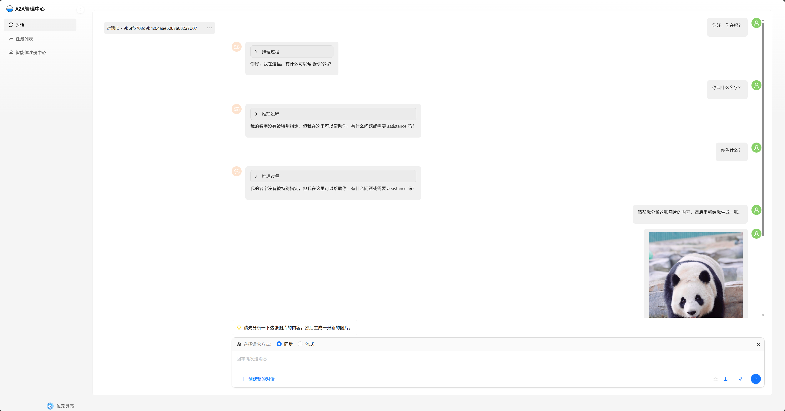
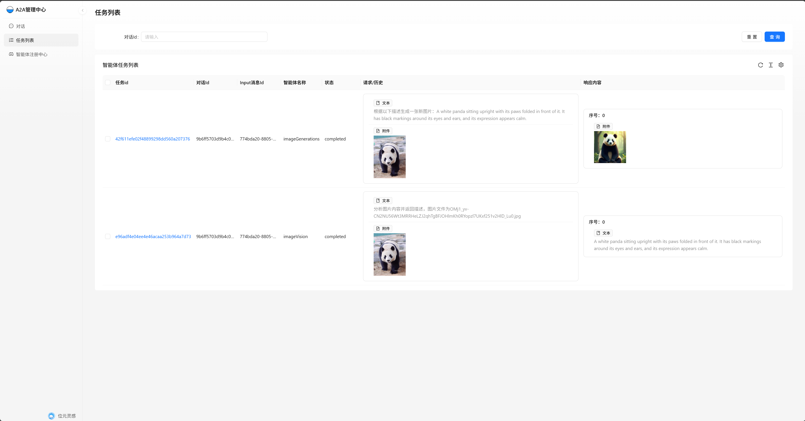
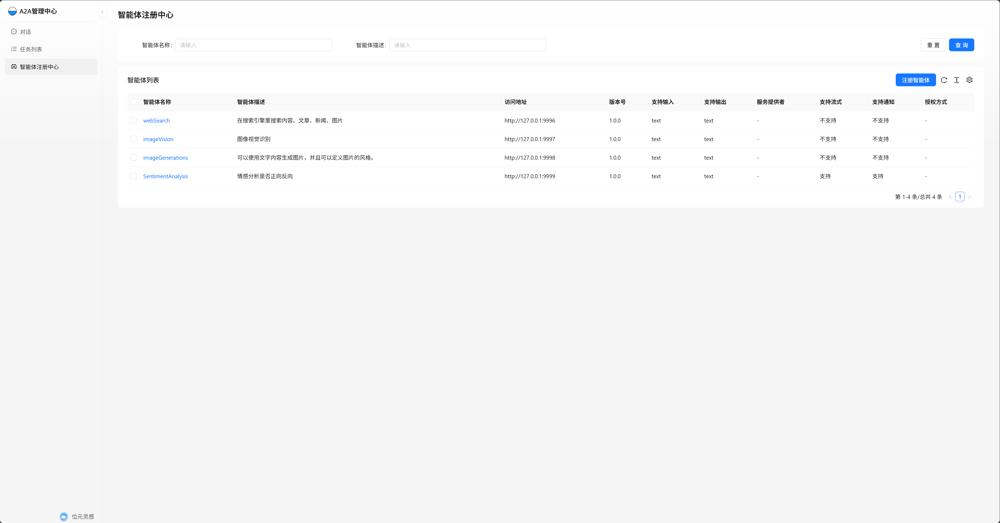

<div align="center">
  
</div>

<p align="right">
  <a href="README.zh-CN.md">中文</a> | <b>English</b>
</p>

# A2A Protocol Implementation Based on Java Spring Framework

## Project Overview
This project is an implementation of the A2A protocol based on the Java Spring framework. The A2A protocol aims to achieve interoperability between agents. Based on the principles of Google's A2A project, this project provides an out-of-the-box agent interaction solution on top of the Spring AI framework, and implements a frontend interface for convenient multi-agent management and tuning.

## Project Requirements
### Development Environment
- **JDK**: JDK 17 or above

### Reference Links
- [A2A Protocol Introduction](https://developers.googleblog.com/zh-hans/a2a-a-new-era-of-agent-interoperability/)
- [Google A2A GitHub](https://github.com/google/A2A)
- [Spring AI](https://github.com/spring-projects/spring-ai)
- [The front-end project used by this project](https://github.com/MusaeMotion/A2A-manage-front-react)

## A2A Protocol Architecture and Corresponding Modules


### Module Mapping
- **A2A Client**: Corresponds to `framework/a2a-agent-client`, responsible for communicating with the A2A Server, encapsulating network requests, message processing, and other basic functions.
- **A2A Server**: Corresponds to `framework/a2a-agent-server`, handles client requests and provides agent services.
- **HostAgent and Remote Agent**: Corresponds to `framework/a2a-host-agent`, implements agent management and scheduling. It manages and maintains agent states, processes client requests, and assigns them to appropriate agents.
- **Front-End**: See the accompanying frontend screenshots for an intuitive user interface.[A2A-manage-front](https://github.com/MusaeMotion/A2A-manage-front-react)




## 💡 Detailed Module Introduction

### A2A Root Project
- **agent-client-multiple-web**: HostAgent based on Spring AI and Spring Boot WebServer, corresponding to the original A2A project's `/samples/python/hosts/multiagent`. This module provides a web interface for multi-agent interaction, allowing users to interact with agents via a browser. After starting this module, visit `http://localhost:8080` to access the interface.
- **agent-client-single-cli**: SimpleAgent command-line DEMO based on Spring AI and Spring Boot, corresponding to the original A2A project's `/samples/python/hosts/cli`. Users can interact with agents via the command line, suitable for quick testing and development. Start the program by running `java -jar agent-client-single-cli.jar` in the command line and follow the prompts.
- **agent-server-ollama-sentiment-analysis**: Sentiment Analysis Agent A2A Server, a remote agent DEMO implemented with Spring AI and Spring Boot.
- **agent-server-ollama-vision**: Vision Recognition Agent A2A Server, a remote agent DEMO implemented with Spring AI and Spring Boot.
- **agent-server-zhipu-generate-images**: Zhipu Text-to-Image Agent A2A Server, a remote agent DEMO implemented with Spring AI and Spring Boot.

### framework Directory
- **a2a-agent-client**: A2A protocol client middleware, providing basic communication functions for client modules, encapsulating network requests, message processing, etc.
- **a2a-agent-server**: Middleware referenced by the A2A Server project, providing common services and tools for server modules.
- **a2a-common**: Common module, containing classes, utility methods, and constants shared by multiple modules in the project.
- **a2a-host-agent**: HostAgent implementation, responsible for managing and scheduling agents, processing client requests, and assigning them to appropriate agents. This module implements agent registration, list query, deletion, and other functions to ensure efficient agent management.
- **agent-core**: Supports HostAgent, implemented based on Spring AI. Provides core agent functions such as message processing, state management, and tool invocation.

## 📚 Submodule Documentation Index

- [agent-server-ollama-sentiment-analysis (Sentiment Analysis Agent)](agent-server-ollama-sentiment-analysis/README.md)
- [agent-server-ollama-vision (Vision Recognition Agent)](agent-server-ollama-vision/README.md)
- [agent-server-web-search (Web Search Agent)](agent-server-web-search/README.md)
- [agent-server-zhipu-generate-images (Text-to-Image Agent)](agent-server-zhipu-generate-images/README.md)

## BOM（Bill of Materials） import

```maven
<dependencyManagement>
    <dependencies>
      <dependency>
        <groupId>io.github.musaemotion</groupId>
        <artifactId>a2a-pom</artifactId>
        <version>0.2.8</version>
        <type>pom</type>
        <scope>import</scope>
      </dependency>
    </dependencies>
  </dependencyManagement>
```

## ⚙️ Project Building and Startup
### Project Building
The project uses Maven for building. Execute the following command in the project root directory:
```bash
mvn clean install
```

### Project Startup
1. Start the Spring Boot project beginning with "agent - server" (the agent project).
2. Start the "agent - client - multiple - web" project.
3. Start the supporting frontend project.
4. Register on the frontend management backend by filling in the agent address.

### 📝 Feedback and Contribution
If you find any issues or have suggestions during use, you are welcome to provide valuable feedback. You can participate in project development by submitting issues or pull requests.

### Other details
1. **JWK Verification**: Notice Server has implemented JWK.
2. **Based on Spring AI**:Quick setup and ready - to - use configuration via the Spring AI framework.
3. **Other** :The frontend, built on Ant Design (React), handles interactions with the Host Agent. It links conversations to tasks, making it easier to track task execution and fine - tune as needed.


## License
This project is licensed under the Apache License 2.0.  
See the [LICENSE](LICENSE) file for details.