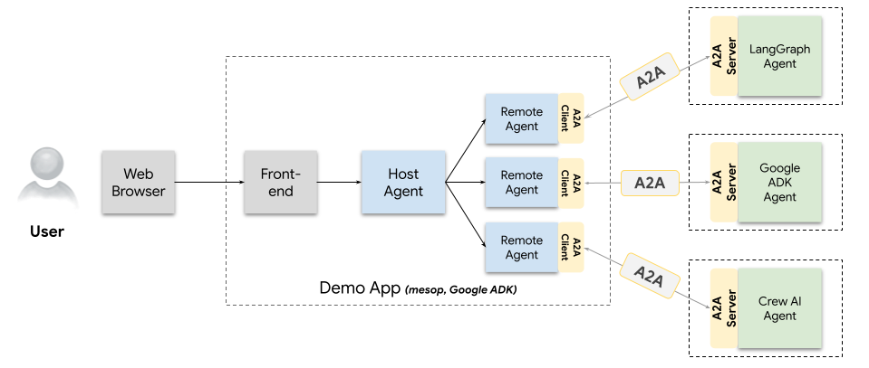
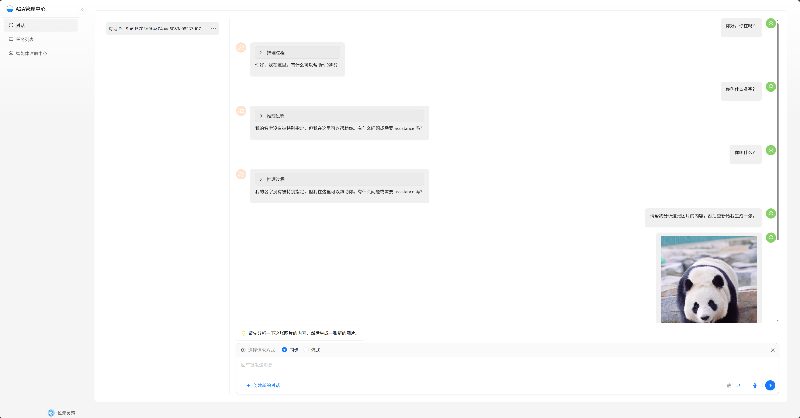
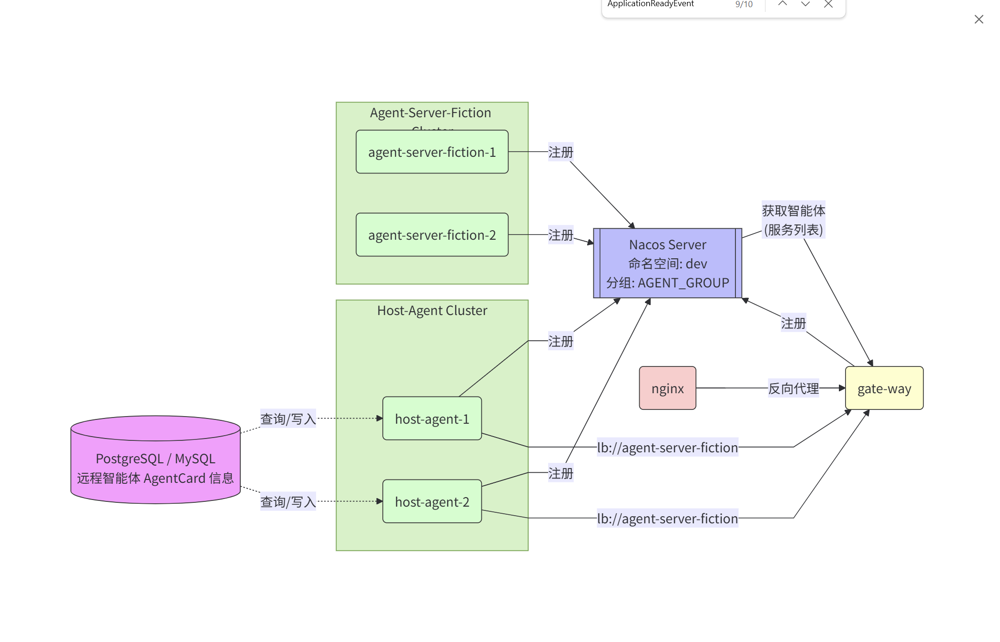

<div align="center">
  
</div>

<p align="right">
  <b>中文</b> | <a href="README.md">English</a>
</p>

# A2A 协议基于 Java Spring 框架实现

## 项目概述
本项目是基于 Java Spring 框架对 A2A 协议的实现。A2A 协议旨在实现智能体之间的互操作性，本项目基于谷歌 A2A 项目的原理，在 Spring AI 框架基础上提供了开箱即用的智能体交互解决方案，并实现了前端界面方便多智能体管理与对话与任务关联。

## 项目要求
### 开发环境
- **JDK**：JDK17 及以上

### 参考链接
- [A2A 协议介绍](https://developers.googleblog.com/zh-hans/a2a-a-new-era-of-agent-interoperability/)
- [Google A2A GitHub](https://github.com/google/A2A)
- [Spring AI](https://github.com/spring-projects/spring-ai)
- [本项目配套前端](https://github.com/MusaeMotion/A2A-manage-front-react)

## A2A 协议架构及对应模块


### 模块对应关系
- **A2A Client**：本项目对应模块为 `framework/a2a-agent-client`，负责与 A2A Server 进行通信，封装了网络请求、消息处理等基础功能。
- **A2A Server**：本项目对应模块为 `framework/a2a-agent-server`，处理客户端的请求，提供智能体服务。
- **HostAgent 和 Remote Agent**：本项目对应模块为 `framework/a2a-host-agent`，实现智能体的管理和调度。它负责管理和维护智能体的状态，处理客户端的请求并分配给合适的智能体进行处理。
- **Front-End**：见配套前端截图，提供了直观的用户交互界面。[A2A-manage-front](https://github.com/MusaeMotion/A2A-manage-front-react)



## 💡项目模块详细介绍

### A2A 根项目
- **agent-client-multiple-web**：HostAgent 基于 Spring AI 和 Spring Boot 的 WebServer，对应原 A2A 项目的 `/samples/python/hosts/multiagent`。该模块提供了一个多智能体交互的 Web 界面，用户可以通过浏览器与智能体进行交互。启动该模块后，访问 `http://localhost:8080` 即可进入交互界面。
- **agent-client-single-cli**：SimpleAgent 基于 Spring AI 和 Spring Boot 的命令行控制台 DEMO，对应原 A2A 项目的 `/samples/python/hosts/cli`。用户可以通过命令行输入与智能体进行交互，适合快速测试和开发环境使用。在命令行中输入 `java -jar agent-client-single-cli.jar` 启动程序，然后按照提示输入指令。
- **agent-server-ollama-sentiment-analysis**：情感分析智能体 A2A Server，基于 Spring AI 和 Spring Boot 实现的远程智能体DEMO。
- **agent-server-ollama-vision**：识别智能体 A2A Server，基于Spring AI 和 Spring Boot 实现的远程智能体 EMO。
- **agent-server-zhipu-generate-images**：智谱文生图智能体 A2A Server，基于Spring AI 和 Spring Boot 实现的远程智能体DEMO。

### framework 框架根目录
- **a2a-agent-client**：A2A 协议客户端中间件，为客户端模块提供与服务器通信的基础功能，封装了网络请求、消息处理等逻辑。
- **a2a-agent-server**：A2A Server 项目引用中间件，为服务器模块提供通用的服务和工具。
- **a2a-common**：公共模块，包含项目中多个模块共享的类、工具方法和常量等。
- **a2a-host-agent**：HostAgent 实现，负责管理和调度智能体，处理客户端的请求并分配给合适的智能体进行处理。该模块实现了智能体的注册、列表查询、删除等功能，确保智能体的高效管理。
- **agent-core**：支撑 HostAgent，基于 Spring AI 实现。提供智能体的核心功能，如消息处理、状态管理、工具调用等。

## 📚 配置文件示例目录

- [agent-server-ollama-sentiment-analysis（情感分析智能体）](agent-server-ollama-sentiment-analysis/README.zh-CN.md)
- [agent-server-ollama-vision（视觉识别智能体）](agent-server-ollama-vision/README.zh-CN.md)
- [agent-server-web-search（Web 搜索智能体）](agent-server-web-search/README.zh-CN.md)
- [agent-server-zhipu-generate-images（文生图智能体）](agent-server-zhipu-generate-images/README.zh-CN.md)

## 依赖管理 物料清单方式引入
```maven
<dependencyManagement>
    <dependencies>
      <dependency>
        <groupId>io.github.musaemotion</groupId>
        <artifactId>a2a-pom</artifactId>
          <version>0.3.5</version>
        <type>pom</type>
        <scope>import</scope>
      </dependency>
    </dependencies>
  </dependencyManagement>
```

## ⚙️项目构建与启动
### 项目构建
项目使用 Maven 进行构建，在项目根目录下执行以下命令：
```bash
mvn clean install
```

### 项目启动
1. 启动 agent-server 开头的 spring boot 项目(智能体项目)。
2. 启动 agent-client-multiple-web 项目。
3. 启动 配套前端项目。
4. 在前端管理后台通过填写智能体地址完成注册。

# 微服务实现方案 
1. 使用 Spring Cloud GateWay 统一网关 接收两个客户请求来源:
   - 用户前端 . 
   - host-agent .
2. 使用 nacos 作为注册中心（注册：微服务的智能体、网关、host-agent）

### 注意：
 1. 本项目提供了简单的 demo实现，nacos 相关的配置和设置，账户设置不在本demo讨论范畴，请异步到官方去按照启动并且设置
 2. 因为 agent-client-nacos-gateway（网关）启动时会自动去读取 nacos 服务列表，所以请把需要微服务的只能体和 agent-client-multiple-web（host-agent）启动之后最后启动
    agent-client-nacos-gateway, gateway做了三个必要工作 
    - 获取智能体列表动态构建 远程智能体访问路由（供 host-agent 访问）
    - 动态构建 host-agent 访问路由（供 nginx/其他 访问）
    - 路由构建完成之后 把所有微服务化的远程智能体自动注册到 host-agent (省去了手动注册，并且统一了访问路径)
    - 
 3. agent-client-multiple-web（host-agent）默认是非微服务实现，有跨域相关的设置在项目里 WebMvcConfig类，如果使用统一网访问，请注释掉跨域设置代码，因为会和网络的跨域配置代码产生冲突
 4. 对于注册到 nocas 的服务需要动态构建路由，所以本demo源码 固定了一个微服务的命名规则
    - 远程智能体 agent-  作为前缀
    - host-agent 使用 host- 作为前缀
 5. gateway 会动态去修改 智能体配置项：card-url 值。 访问配置中心的 DataId: 服务名.yaml, 所以智能体配置中心使用该配置  file-extension: yaml, 
 6. 如果想快速查看微服务的效果
    - agent-server-nacos-fiction
    - agent-client-multiple-web （注释跨域代码）
    - agent-client-nacos-gateway 
    - 修改配套前端  .env 文件 UMI_APP_API_URL=http://127.0.0.1:10000 
- [Nacos GitHub Link](https://github.com/alibaba/nacos)
### 微服务版本 系统架构拓扑图



### 📝反馈与贡献
如果您在使用过程中发现任何不合理之处或 BUG，欢迎您提出宝贵的意见和建议。您可以通过提交 issue 或 pull request 的方式参与项目的开发。

### 其他细节
1. **JWK验证**：Notice Server 实现了JWK。
2. **基于Spring AI** ：通过Spring AI框架配置快速开箱即用。
3. **其他**：前端基于 Ant Design（React）实现与Host Agent的交互功能，实现了在对话过程与任务关联，便于追踪任务执行情况，方便针对性调优。

## 许可证
本项目遵循 Apache License 2.0 开源协议，详见 [LICENSE](LICENSE) 文件。